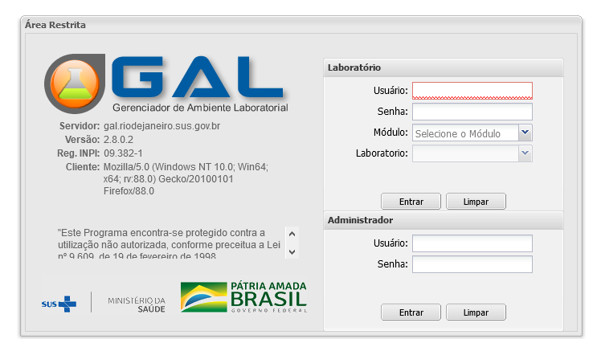
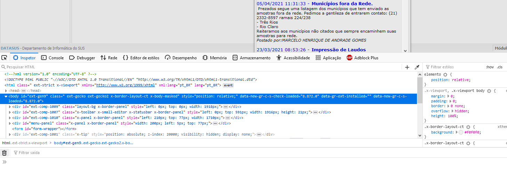
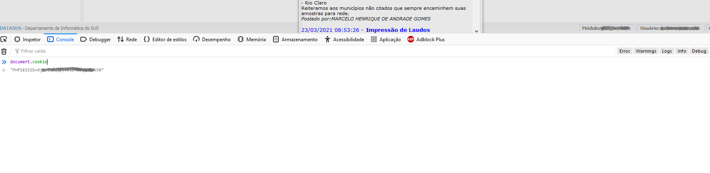
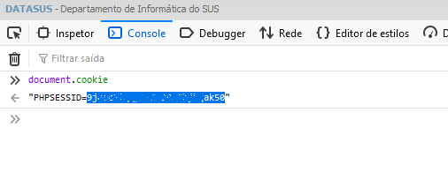

# :mask: Report Generator for [GAL](https://gal.riodejaneiro.sus.gov.br/) ( SARS-COV-2 )

That project has been developed to support Rio de Janeiro's health professionals to control the data about PCR-RT. Generating reports, getting data, generating knowledge...

## Getting Started

The objective of that project is to generate reports from GAL (Gerenciador de Ambiente Laboratorial - Laboratory Environment Manager) to help control the administration of PCR diagnosis (SWAB).

## Requisites

This project requires a [Python 3](https://www.python.org/) distribution, the [sys library](https://docs.python.org/3/library/sys.html), the [xlsxwriter library](https://xlsxwriter.readthedocs.io/) the [Urllib3 library](https://github.com/urllib3/urllib3) and the [requests library](https://docs.python-requests.org/en/master/).

```
* Python 3
* Requests Library
* Urllib3 Library
* Sys
* Xlsxwriter
```

## Examples

This library is very easy to use. First, import the class.
```python
>>> from gal_crawler import get_swab_result
```

After import the class, initialize with an initial date, a final date and your GAL's PHPSESSIONID cookie. 

```python
>>> crawler = get_swab_result(init_date="12/04/2021", end_date="01/05/2021", PHPSESSID="1M_A_C00K13")
```

Otherwise, you can set load as True. So, the program will request you to inform an archive which contains a list of ips separated with a break line.

```python
>>> crawler = get_swab_result(load=True, PHPSESSID="1M_A_C00K13")
"Enter with the name of the archive that contains a list of ids separated with break line: "
```

So, when you want to capture data from the server, call the run method and wait from the end of execution.

```python
>>> crawler.run()
True
```
> Note: That method will return **False** if an error occurred or **True** if run correctly.

After the run, you can save the captured data with the method save_output. That method receive and string which contains the name of the archive. The archive will be exported as an Excel file.

```python
>>> crawler.save_output("output")
```

The code will look something like this:
```python
>>> from gal_crawler import get_swab_result
>>> crawler = get_swab_result(init_date="12/04/2021", end_date="01/05/2021", PHPSESSID="1M_A_C00K13")
>>> crawler.run()
>>> crawler.save_output("output")
```
or
```python
>>> from gal_crawler import get_swab_result
>>> crawler = get_swab_result(load=True, PHPSESSID="1M_A_C00K13")
"Enter with the name of the archive that contains a list of ids separated with break line:" "archive.txt"
>>> crawler.run()
>>> crawler.save_output("output")
```

## The PHPSESSID

The PHPSESSID is a very important cookie for that application. Otherwise, the crawler will don't have permission to access the GAL's data.
Now, I'll show how you can get that precious cookie.

---
#### - First, you have to login into your GAL's account.

---
---
#### - So, if you press F12 key, will appear an widget like that.

---
---
#### - Go to Console web(the second option) and input that command: document.cookie

---
---
#### - Now, copy the cookie after the equal signal and feed the application.

---

## Notes

- That solution has been developed for health professionals and it can expose confidential data from citizens. Please, take careful!
